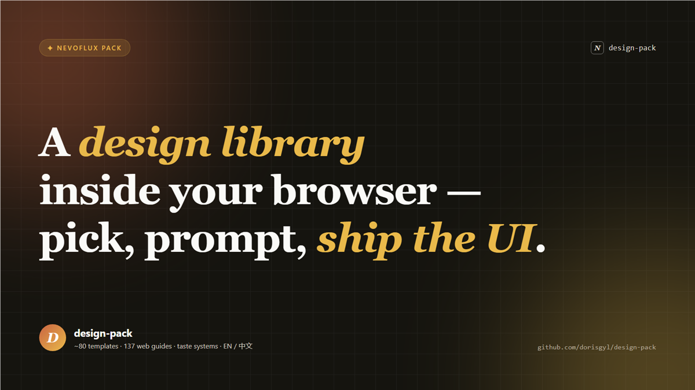

# design-pack

[English](README.md) · [简体中文](README.zh-CN.md)



**A design knowledge base and UI generator for the [NevoFlux browser](https://github.com/dorisgyl/nevoflux).**
It loads a large, curated library of modern design requirements, specs, templates, and web-platform
guides into the browser's GBrain knowledge base — then lets you pick what you need and have the agent
generate finished, on-brand UI from it, either from a visual dashboard or straight from the sidebar.

## What you get

- **A retrievable design library inside your browser**, stored in GBrain and searchable in English and 中文:
  - **~80 ready-to-use templates** — landing pages, pricing, hero & feature sections, decks/slides,
    social cards, dashboards, posters, resumes, docs, mobile screens, video frames… each with a real preview image.
  - **A 论文图 / CS-paper figure set** — 8 editable **HTML/SVG** figures (vector, not raster): a layered
    **architecture**, a **method pipeline**, a **method framework**, an **agent workflow**, a **system
    data-flow** graph, a **mechanism** close-up, a **case walkthrough**, and a results **evidence board** —
    each on a distinct layout grammar, with real **recolorable icons**, fully hand-editable and bilingual.
    Backed by a CS "framework-figure drawing method" spec and a searchable icon library.
  - **A 小红书图文 / XHS Carousel set** — 5 editable **HTML** card archetypes (cover, content, quote,
    compare, CTA) at 1080×1440, all sharing one **visual master** (a `:root` token block) so a set reads
    as one carousel. Notion-card aesthetic, fully editable and bilingual; export each to PNG from the
    Canvas to post. Backed by a 小红书 "visual-director" method spec.
  - **137 modern web-platform guides** — accessibility, CSS, forms, performance, user-experience,
    view transitions, anchor positioning, passkeys… concrete patterns, gotchas, and fallbacks.
  - **13 design-taste systems** — brutalist, minimalist, soft/premium, brand-kit, the anti-slop
    "tasteskill", plus image-to-code and image-generation workflows.
  - **Baseline requirements & specs** — accessibility (WCAG 2.2 AA), responsive, and a color / type /
    spacing design system.
- **A selection dashboard** (opens in *My Canvas*): browse everything grouped by type and category,
  jump to any group from a sticky side-nav, filter by type chips or free-text search, toggle
  **EN / 中文**, and preview a real thumbnail of every template.
- **One-click generation**: tick the requirements / specs / templates / guides you want, describe what
  to build, and the agent pulls the full design bases from GBrain and **generates a new Canvas app (HTML)**
  that follows them.
- **Works from the sidebar too** — just ask in chat ("use design-pack's color spec to build a SaaS hero");
  the same skill retrieves and generates.
- **Fully extensible** — import your own requirements, specs, or templates into GBrain and the dashboard
  rebuilds itself.

## What you can achieve

Ship interfaces that are **modern, accessible, responsive, and not templated** — faster:

- Turn a one-line brief into a real landing page, pricing page, deck, social card, or dashboard that
  already respects a design system.
- Generate UI that uses **current web-platform techniques** (from the guides) instead of dated patterns,
  with accessibility and responsiveness built in.
- Apply a chosen **aesthetic direction** (minimalist, brutalist, premium…) consistently.
- Draw a **CS-paper figure** — architecture, method pipeline, agent workflow, mechanism… — as **editable
  vector HTML/SVG** you can recolor and fine-tune, not a flattened screenshot.
- Direct a **小红书 / XHS carousel** as editable **HTML** cards — pick the cover / content / quote /
  compare / CTA archetypes, keep one locked visual master across pages, then export to PNG — instead of
  prompting a model for flattened images.
- Keep a growing, **bilingual, team-shareable** design memory the agent can always pull from.

## The two skills

### `design-build` — retrieve & generate

Pulls in the design bases you reference and generates a new Canvas app (HTML) that follows them.

**From the dashboard** (*My Canvas → design-pack*): tick the requirements / specs / templates /
guides you want, type what to build, and click **Generate**. The dashboard composes the message for you.

**From the sidebar** — just ask in chat, no dashboard needed. For example:

> Use design-pack's **color-system** spec and the **landing-hero** template to build a dark-theme
> SaaS analytics landing page. Emphasize "ten-minute onboarding".

> 用 design-pack 的**配色规范** + **定价表**模板,做一个三档定价页,中间档高亮。

> Following design-pack's **accessibility-baseline** and **responsive-baseline**, generate a
> sign-up form with inline validation.

> Build a portfolio hero in the **brutalist** taste from design-pack.

The agent fetches the full pages from GBrain (the ones you named, plus semantically related guides),
then opens a **new canvas** with the generated UI. Tip: name a template, a spec, or a taste by its
title — or open the dashboard if you're not sure what's available.

### `design-curate` — import & extend

Adds **your own** requirements / specs / templates into the pack's GBrain space and rebuilds the
dashboard so they become selectable like the built-ins. For example:

> Add a spec to design-pack called **acme-brand**: the only accent is `#0EA5E9`, headings use Geist,
> spacing is 8pt-based, corners are 12px.

> Import this as a design-pack **template** (category: card) and generate a sample image for it:
> ```html
> <article class="quote-card">…</article>
> ```

> 给 design-pack 新增一个**要求**:所有交互元素必须有可见焦点态,文字对比度 ≥ 4.5:1。

After it writes the pages (and uploads any sample images), the dashboard rebuilds and your new bases
appear alongside the built-in ones — ready for `design-build` to use.

## Install

### 1. Install the NevoFlux browser

- Download: **https://nevoflux.app**
- Or grab a release: https://github.com/dorisgyl/nevoflux/releases

### 2. Install this pack in the browser

Open **`nevoflux://settings` → Packs** and install by repo URL
(`https://github.com/dorisgyl/design-pack`) or a local `pack.toml`. The platform installs, updates,
and rolls back **transactionally from the manifest** — no scripts to run.

<details>
<summary>CLI alternative</summary>

On a machine running the NevoFlux daemon:

```bash
nevoflux pack validate pack.toml
nevoflux pack install pack.toml
```

</details>

## Develop / extend

```bash
node scripts/import-guides.mjs      # (re)import modern-web-guidance guides
node scripts/import-taste.mjs       # (re)import taste-skill skills
node scripts/render-thumbs.mjs      # render template preview thumbnails
node scripts/build-paper-templates.mjs  # rebuild the 论文图 / CS-paper figure seeds (EN + 中文)
node scripts/build-xhs-cards.mjs        # rebuild the 小红书图文 / XHS Carousel seeds (EN + 中文)
node scripts/sync-pack-seeds.mjs    # sync pack.toml's seed list from seed/**
node scripts/build-dashboard.mjs    # rebuild the dashboard (dist/index.html)
node scripts/validate-pack.mjs      # invariant checks
```

Internals — the content model, the agent-side retrieval flow, and platform notes — live in
`docs/superpowers/specs/2026-06-13-design-pack-design.md`.

## Acknowledgements

design-pack stands on the shoulders of three excellent projects, and is mostly a NevoFlux-native
adaptation and re-hosting of their work:

- **[GoogleChrome/modern-web-guidance](https://github.com/GoogleChrome/modern-web-guidance)** — the
  "semantic search + Guide Fetch" idea and the **137 web-platform guides** that form the technical
  backbone of this pack.
- **[taste-skill](https://github.com/Leonxlnx/taste-skill)** — the design-taste / anti-slop frontend
  skills (brutalist, minimalist, soft, tasteskill, brand-kit, image-gen…) that give the pack its
  **aesthetic direction**.
- **[html-anything](https://github.com/nexu-io/html-anything)** — the **~80 template skills**
  (`SKILL.md` + `example.html`) that became this pack's bilingual template library.

Heartfelt thanks to their authors. design-pack retrieves their content through GBrain and localizes it
for NevoFlux; all original credit belongs to these projects.
